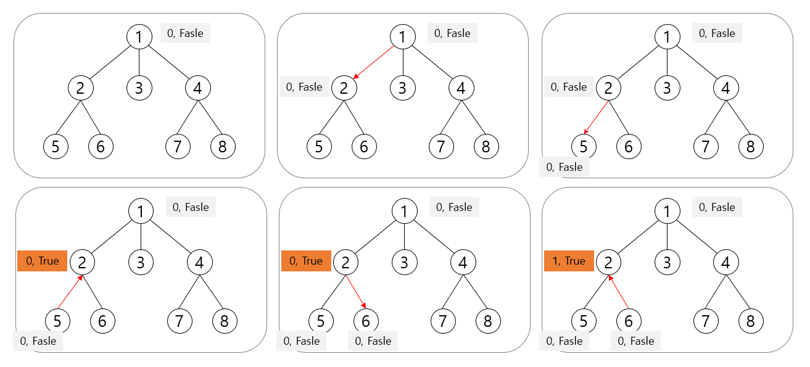

### 내 풀이

1. 이렇게 푼 이유?

   - 얼리어답터인지 아닌지 선택하는 건 비슷하게 나누었는데 어떻게 DP를 써야할지 몰라서 풀지 못함.
   - 블로그 풀이의 포인트는 
     - 재귀와 DP를 같이 사용해서 Top-down 방식으로 푸는 것!
     - DP를 작성하는 점화식을 특정 조건(내가 얼리어답터인지 아닌지)에 따라 다르게 두는 것!
   
2. 실행시간

   - 6060ms (python)

3. 코드1_실패(시간초과)

   ```python
   import sys
   sys.stdin = open('input.txt')
   q = lambda : map(int, sys.stdin.readline().split())
   
   # 친구가 모두 얼리어답터여야 받아 들인다
   # 친구는 부모 노드, 자식 노드들이다
   
   # 자식이 중 하나라도 얼리어답터가 아니면 부모는 반드시 얼리어답터
   # 자식이 모두 얼리어답터이면 부모는 얼리어답터여도 되고 아니여도 되고
   
   N = int(input())
   
   tree = [[] for _ in range(N+1)]
   parent = [i for i in range(N+1)]
   leaf = []
   check = [0] * (N+1)
   
   for _ in range(N-1):
       p, c = q()
       tree[p].append(c)
       parent[c] = p
   
   for i in range(1, N+1):
       if not tree[i]:
           leaf.append(i)
           check[parent[i]] = 1
   
   
   def isNotChildEarly(node):
       for child in tree[node]:
           if not check[child]:
               return True
       return False
   
   
   while leaf:
       node = leaf.pop(0)
   
       if isNotChildEarly(node):
           check[node] = 1
   
           if node != parent[node]:
               leaf.append(parent[node])
   
       else: # 모든 자식이 얼리어답터
           if node != parent[node]:
               leaf.append(parent[node])
   
   
   print(sum(check))
   ```

4. 코드2_블로그 참고

   ```python
   import sys
   sys.stdin = open('input.txt')
   q = lambda : map(int, sys.stdin.readline().split())
   sys.setrecursionlimit(10**9)
   
   # 6060ms
   
   # DP(i, true) = min(DP(i 의 자식, true), DP(i 의 자식, false))들의 총합 + 1
   # i가 얼리어답터이면 자식은 얼리어답터여도 되고, 아니여도 되고
   
   # DP(i, false) = DP(i 의 자식, true) 들의 총합
   # i가 얼리어답터가 아니면, 자식은 반드시 얼리어답터
   
   n = int(input())
   graph  = [[] for _ in range(n + 1)]
   visited = [False] * (n + 1)
   
   for _ in range(n - 1):
     u, v = q()
     graph[u].append(v)
     graph[v].append(u)
   
   # [정점 번호][얼리 어답터 체크]
   dp = [[0, 0] for _ in range(n + 1)]
   # 해당 노드가 얼리어답터가 아닐때, 맞을때 서브트리(자신 포함) 얼리어답터 최소수
   
   
   def solve_dp(num):
     visited[num] = True
     dp[num][0] = 0 # 자식은 모르겠고 일단 내가 얼리어답터 아니니 0
     dp[num][1] = 1 # 자식은 모르겠고 일단 내가 얼리어답터니까 1
   
     for i in graph[num]: # 연결된 노드 중에서
       if not visited[i]: # 방문하지 않은 -> 결국 자식 노드가 됨
         solve_dp(i)
         dp[num][0] += dp[i][1] # 내가 얼리어답터 아니면, 자식은 반드시 얼리어답터
         dp[num][1] += min(dp[i][0], dp[i][1]) # 내가 얼리어답터면, 자식은 얼리어답터여도 되고 아니여도 됨
   
   solve_dp(1)
   print(min(dp[1][0], dp[1][1]))
   ```

   

### 다른 사람의 풀이

1. 실행시간

   - 4088ms

2. 코드

   ```python
   import sys
   sys.stdin = open('input.txt')
   input = sys.stdin.readline
   sys.setrecursionlimit(10000000)
   
   # 4088 ms
   
   n = int(input())
   adj = [[] for i in range(n+11)]
   for i in range(n-1):
       a,b = map(int,input().split())
       adj[a].append(b)
       adj[b].append(a)
   
   def dfs(u,p):
       mark = False # 내가 얼리어답터인지 아닌지
       num = 0 # 서브트리의 최소 얼리어답터 수
       for v in adj[u]:
           if v==p: continue # 인접노드가 부모인 경우 스킵
           tmp, m = dfs(v,u) # tmp: v를 root로 하는 서브트리의 최소 얼리어탑터 수 / m : v가 얼리어답터인지 아닌지
           num+=tmp
           if not m: mark=True # m 이 False 인경우 = 자식이 얼리어답터가 아님 = 내가 얼리어답터여야 함
       if mark: num+=1 # 내가 얼리어답터니까 +1
       return num, mark
   
   print(dfs(1,0)[0])
   ```
   
3. 해설

   - 방식은 비슷한데 따로 DP 배열을 두지 않아서 메모리나 실행시간 측면에서 낫다.
   - 기본적으로 현재 노드가 얼리어답터가 아님을 가정.
     - 현재 노드의 자식 노드가 없으면 그 노드는 얼리어답터가 아님
   - 자식 노드가 모두 얼리어답터면 현재노드는 얼리어답터가 아님
   - 자식노드 중 하나라도 얼리어답터가 아니면 그 노드는 얼리어답터임



- 사실 DP로 min을 할 필요가 없다.
- 내가 원래 만들고자한 방향도 이거랑 비슷한것 같다.
- 자식중 하나라도 얼리어답터가 아니면 부모는 무조건 얼리어답터
- 자식이 모두 얼리어답터이거나, 자식이 없다면 부모는 얼리어답터가 아니다.