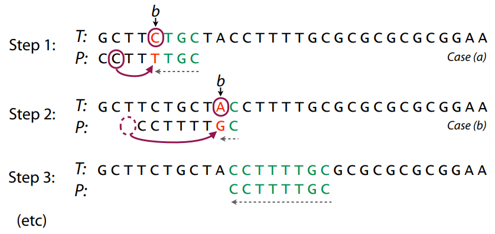

# 1주차 알고리즘 - 패턴 매칭

[toc]

## 문자열 패턴 매칭 알고리즘

1. Naive Matching (원시적인 매칭) 
   - Brute Force (고지식한 패턴 검색 알고리즘). 하나씩 모든 문자를 **일일이 비교**하는 방식
   - 최악의 경우 시간 복잡도 O(MN) (총 문자열 길이 N, 타겟 문자열 길이 M)
2. Automata Algorithm (오토마타를 이용한 매칭)
   - 추가 예정
3. Rabin-Karp Algorithm (라빈-카프 알고리즘)
   - 수행시간 Θ(n)
4. Knuth-Morris-Pratt Algorithm (KMP 알고리즘)
   - 불일치가 발생한 텍스트의 앞 부분에 어떤 문자가 있는지 미리 알고 있으므로, **불일치가 발생한 앞 부분에 대해서는 다시 비교하지 않고 매칭**을 수행
   - **시간 복잡도 O(M+N)**, 수행시간 Θ(n)
5. Boyer-Moore Algorithm  (보이어-무어 알고리즘)
   - 오른쪽에서 왼쪽으로 비교한다.
   - 최선의 경우 Ω(n), **최악의 경우 Θ(mn)** . 일반적으로 Θ(n) 보다 시간이 덜 든다.


## KMP (Knuth-Morris-Pratt)

1. [실패 함수(Failure Function)](https://en.wikipedia.org/wiki/Knuth%E2%80%93Morris%E2%80%93Pratt_algorithm#%22Partial_match%22_table_(also_known_as_%22failure_function%22))

   - 실패 함수 Pi[i] : 문자열 W에 대해 0~(i-1)번째 인덱스까지 **접두사==접미사가 되는 최대 접두사(접미사)의 길이**를 말한다.
   - 실패 함수는 문자 매칭에 실패했을 때, 얼만큼 건너 뛰어야할 지 알려준다.

2. target word `ACBDACBDAACD` 에 대해 실패함수 작성하기

   | i     | 0    | 1    | 2    | 3    | 4    | 5    | 6    | 7    | 8    | 9    | 10   | 11   |
   | ----- | ---- | ---- | ---- | ---- | ---- | ---- | ---- | ---- | ---- | ---- | ---- | ---- |
   | W[i]  | A    | C    | B    | D    | A    | C    | B    | D    | A    | A    | C    | D    |
   | Pi[i] | -1   | 0    | 0    | 0    | 0    | 1    | 2    | 3    | 4    | 5    | 1    | 2    |

   - Pi[0] = -1
   - Pi[1] : 0~(1-1)번째 인덱스 `A` 에서 접두사==접미사가 되는 최대 접두사는 없고 길이는 0
   - Pi[5] : 0~(5-1)번째 인덱스 `ACBDA` 에서 접두사==접미사가 되는 최대 접두사는 `A`이고 길이는 1
   - Pi[7] : 0~(7-1)번째 인덱스 `ACBDACB`에서 접두사==접미사가 되는 최대 접두사는 `ACB`이고 길이는 3
   - Pi[9] : 0~(9-1)번째 인덱스 `ACBDACBDA`에서 접두사==접미사가 되는 최대 접두사는 `ACBDA` 이고 길이는 5

3. KMP 알고리즘

   - target word : `ABCDABD` 와 word : `ABC ABCDAB ABCDABCDABDE`

   - `ABCDABD`에 대해 실패함수를 작성하기

     | i     | 0    | 1    | 2    | 3    | 4    | 5    | 6    |
     | ----- | ---- | ---- | ---- | ---- | ---- | ---- | ---- |
     | W[i]  | A    | B    | C    | D    | A    | B    | D    |
     | Pi[i] | -1   | 0    | 0    | 0    | 0    | 1    | 2    |

   - KMP 진행하기 : 매칭에 실패한 i에 대해, `i - Pi[i]` 만큼 점프한다.

     - 현재 위치 0 , `[A]BC ABCDAB ABCDABCDABDE` : i=3 에서 매칭 실패. Pi[3]=0 이므로, (3) - (0)을 점프한다.
     - 현재 위치 3 , `ABC[ ]ABCDAB ABCDABCDABDE` : i=0 에서 매칭 실패. Pi[0]=-1 이므로, (0) - (-1)을 점프한다.
     - 현재 위치 4 , `ABC [A]BCDAB ABCDABCDABDE` : i=6 에서 매칭 실패. Pi[6]=2 이므로, (6) - (2)을 점프한다.
     - 현재 위치 8 , `ABC ABCD[A]B ABCDABCDABDE` : i=2 에서 매칭 실패. Pi[2]=0 이므로, (2) - (0)을 점프한다.
     - ... 반복, 현재 위치가 최대 길이보다 커지면 매칭 실패

4. 파이썬 구현

   ```python
   def fail_function(W:str)->list:
       Pi = [0] * len(W)
       Pi[0] = -1
       j = 0
       for i in range(1, len(W)-1):
           while j > 0 and W[i] != W[j]:
               j = Pi[j]
           if W[i] == W[j]:
               j += 1
               Pi[i+1] = j
       return Pi
   
   def KMP(pat:str, txt:str)->list:
       pi = fail_function(pat)    # pi: pat 실패함수
   
       n, m = len(txt), len(pat)  # n: txt 길이, m: pat 길이
       i, j = 0, 0                # i: txt's idx, j: pat's idx
   
       ans = []                   # 어느 인덱스에서 답이 나오는지
       while i < n:
           if txt[i] == pat[j]:     # i, j인덱스 글자가 같으면
               i += 1               # i, j 1씩 증가시켜서
               j += 1               # 다음 글자를 비교하러 가기
               if j == m:           # pat을 찾았으면
                   ans.append(i-j)  # ans에 추가하고
                   j = 0            # 다음을 위해 0으로 만들어주기
           else:
               j = pi[j]          # j를 실패함수 값으로
               if j < 0:          # j가 0이면 (-1)
                   i += 1         # i, j 1씩 올려주기
                   j += 1
       # print(ans)
       return ans
   
   KMP('ABCDABD', 'ABC ABCDAB ABCDABCDABDE') # [15]
   ```


## Boyer-Moore Algorithm

1. 보이어-무어 알고리즘 (이거 너무 어려움... 모르겠음....)

   - 기존 패턴 검색 알고리즘들이 왼쪽에서 오른쪽으로 검색했다면, 보이어-무어 알고리즘에서는 오른쪽에서 왼쪽으로 검색한다.
   - skip 방식은 Bad character rule와 Good suffix rule 중에 더 큰 값만큼 이동하는 방식을 선택한다.

2. skip rule

   - The bad character rule

     

     - 텍스트 T 에 불일치가 발생했을 때 (b지점 `C`) 패턴 P에서 불일치 왼쪽으로 아직 검사를 받지 않은 문자열 p (`CCTT`)에 대해...

       1. 문자 b가 p에 있다면 (그 중에서 가장 왼쪽) 그 문자가 b와 매칭되도록 패턴을 이동시킨다. (step2)
       2. 문자 b가 p에 없다면 패턴이 b를 지나치도록 한다. (step3)

     - skip 배열 예시 : CCTTTTGC & rithm

       - skip 배열 = 전체 길이 - 해당 문자의 인덱스(가장 오른쪽에 있는) - 1

       |   패턴1   | 다른 문자 |     C     |     T     |     G     |      |      |
       | :-------: | :-------: | :-------: | :-------: | :-------: | :--: | :--: |
       | 스킵 배열 |     8     | 8-7-1 = 0 | 8-5-1 = 2 | 8-6-1 = 1 |      |      |
       |   패턴2   | 다른 문자 |     r     |     i     |     t     |  h   |  m   |
       | 스킵 배열 |     5     |     4     |     3     |     2     |  1   |  0   |

   - The good suffix rule

     - 추가 예정인데 추가할 수 있을까요? 너무 어려운데요 

3. pyhon 구현

   ```python
   # https://en.wikipedia.org/wiki/Boyer%E2%80%93Moore_string-search_algorithm
   # 위키에 있는 코드임... 알 수 없음..... 심각함.......
   
   from typing import *
   
   ALPHABET_SIZE = 26
   
   def alphabet_index(c: str) -> int:
       val = ord(c.lower()) - ord("a")
       assert val >= 0 and val < ALPHABET_SIZE
       return val
   
   # fundamental_preprocess에 쓰이는 함수
   def match_length(S: str, idx1: int, idx2: int) -> int:
       if idx1 == idx2:
           return len(S) - idx1
       match_count = 0
       while idx1 < len(S) and idx2 < len(S) and S[idx1] == S[idx2]:
           match_count += 1
           idx1 += 1
           idx2 += 1
       return match_count
   
   # good_suffix_table & full_shift_table 에 쓰이는 함수
   def fundamental_preprocess(S: str) -> List[int]:
       if len(S) == 0:  # Handles case of empty string
           return []
       if len(S) == 1:  # Handles case of single-character string
           return [1]
       z = [0 for x in S]
       z[0] = len(S)
       z[1] = match_length(S, 0, 1)
       for i in range(2, 1 + z[1]):  # Optimization from exercise 1-5
           z[i] = z[1] - i + 1
       # Defines lower and upper limits of z-box
       l = 0
       r = 0
       for i in range(2 + z[1], len(S)):
           if i <= r:  # i falls within existing z-box
               k = i - l
               b = z[k]
               a = r - i + 1
               if b < a:  # b ends within existing z-box
                   z[i] = b
               else:  # b ends at or after the end of the z-box, we need to do an explicit match to the right of the z-box
                   z[i] = a + match_length(S, a, r + 1)
                   l = i
                   r = i + z[i] - 1
           else:  # i does not reside within existing z-box
               z[i] = match_length(S, 0, i)
               if z[i] > 0:
                   l = i
                   r = i + z[i] - 1
       return z
   
   ################# skip table 생성 #################
   def bad_character_table(S: str) -> List[List[int]]:
       if len(S) == 0:
           return [[] for a in range(ALPHABET_SIZE)]
       R = [[-1] for a in range(ALPHABET_SIZE)]
       alpha = [-1 for a in range(ALPHABET_SIZE)]
       for i, c in enumerate(S):
           alpha[alphabet_index(c)] = i
           for j, a in enumerate(alpha):
               R[j].append(a)
       return R
   
   def good_suffix_table(S: str) -> List[int]:
       L = [-1 for c in S]
       N = fundamental_preprocess(S[::-1])  # S[::-1] reverses S
       N.reverse()
       for j in range(0, len(S) - 1):
           i = len(S) - N[j]
           if i != len(S):
               L[i] = j
       return L
   
   # 이건 무슨 함수지..?
   def full_shift_table(S: str) -> List[int]:
       F = [0 for c in S]
       Z = fundamental_preprocess(S)
       longest = 0
       for i, zv in enumerate(reversed(Z)):
           longest = max(zv, longest) if zv == i + 1 else longest
           F[-i - 1] = longest
       return F
   
   
   ################# Boyer-Moore 알고리즘 #################
   def string_search(P, T) -> List[int]:
       if len(P) == 0 or len(T) == 0 or len(T) < len(P):
           return []
   
       matches = []
   
       # Preprocessing
       R = bad_character_table(P)
       L = good_suffix_table(P)
       F = full_shift_table(P)
   
       k = len(P) - 1      # Represents alignment of end of P relative to T
       previous_k = -1     # Represents alignment in previous phase (Galil's rule)
       while k < len(T):
           i = len(P) - 1  # Character to compare in P
           h = k           # Character to compare in T
           while i >= 0 and h > previous_k and P[i] == T[h]:  # Matches starting from end of P
               i -= 1
               h -= 1
           if i == -1 or h == previous_k:  # Match has been found (Galil's rule)
               matches.append(k - len(P) + 1)
               k += len(P) - F[1] if len(P) > 1 else 1
           else:  # No match, shift by max of bad character and good suffix rules
               char_shift = i - R[alphabet_index(T[h])][i]
               if i + 1 == len(P):  # Mismatch happened on first attempt
                   suffix_shift = 1
               elif L[i + 1] == -1:  # Matched suffix does not appear anywhere in P
                   suffix_shift = len(P) - F[i + 1]
               else:               # Matched suffix appears in P
                   suffix_shift = len(P) - 1 - L[i + 1]
               shift = max(char_shift, suffix_shift)
               previous_k = k if shift >= i + 1 else previous_k  # Galil's rule
               k += shift
       return matches
   ```

   


## 기타

1. [문자열 알고리즘 시각화](http://whocouldthat.be/visualizing-string-matching/)

2. [백준 KMP 문제](https://www.acmicpc.net/workbook/view/1062)

   - [ ] 11585 속타는 저녁 메뉴
   - [ ] 1305 광고
   - [ ] 4354 문자열 제곱
   - [ ] 1786 찾기 (basic한 문제라는 듯)
   - [ ] 2401 최대 문자열 붙여넣기
   - [ ] 1893 시저 암호

3. 팰린드롬을 KMP로 풀 수 있다는데 풀어보기

4. 기타 알고리즘

   - Aho-Corasick Algorithm  (아호-코라식 알고리즘)
   - Manber-Myers Algorithm (맨버-마이어스 알고리즘)

   


# 1주차 모의고사 - BOJ 17281

1. [BOJ 17281](https://www.acmicpc.net/problem/17281)

2. 1시간 30분 푼 결과 : fail (코드 미완성, 테케 실패)

   - 문제 이해하기가 어려웠다. 문제 이해하고, 테케 이해하니까 50분 초과
   - 완전 탐색으로 풀면 시간초과가 날 것 같았음.
   - 근데 완전 탐색 이외엔 어떻게 해야할 지 감도 못 잡음.
     - 아마 0을 제일 많이 내는 사람을 뒤로 보내고 하는 식으로 하면 되지 않을까? 해서 짜긴 했는데 풀면서 스스로도 납득 안되는 방법 & 실제로 틀림

3. 랭커 코드

   - 완전 탐색으로 풀었다. itertools 사용해서 순열 만들어서 돌림

4. [itertools](https://docs.python.org/ko/3/library/itertools.html)

   ```python
   import itertools
   
   chars = ['A', 'B', 'C']
   
   # 첫번째 인자는 리스트, 두번째 인자는 선택할 원소의 개수 
   p = itertools.permutations(chars, 2)
   # [('A', 'B'), ('A', 'C'), ('B', 'A'), ('B', 'C'), ('C', 'A'), ('C', 'B')]
   c = itertools.combinations(chars, 2)
   # [('A', 'B'), ('A', 'C'), ('B', 'C')]
   ```

   

