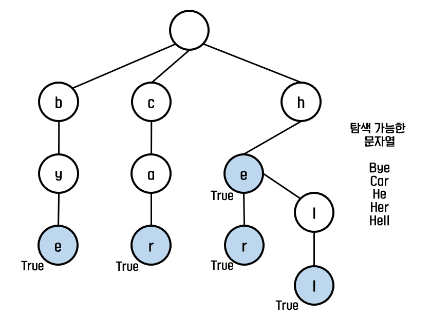
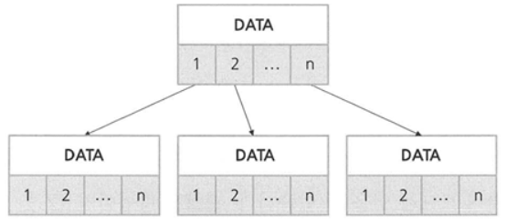
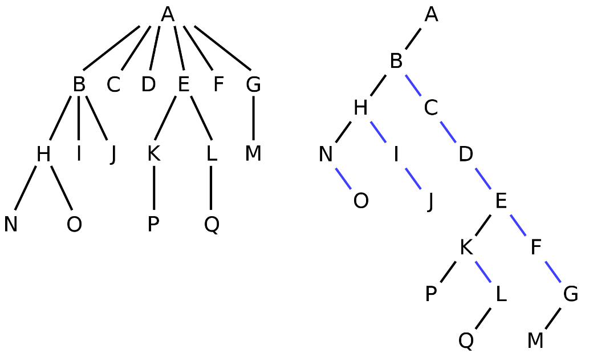
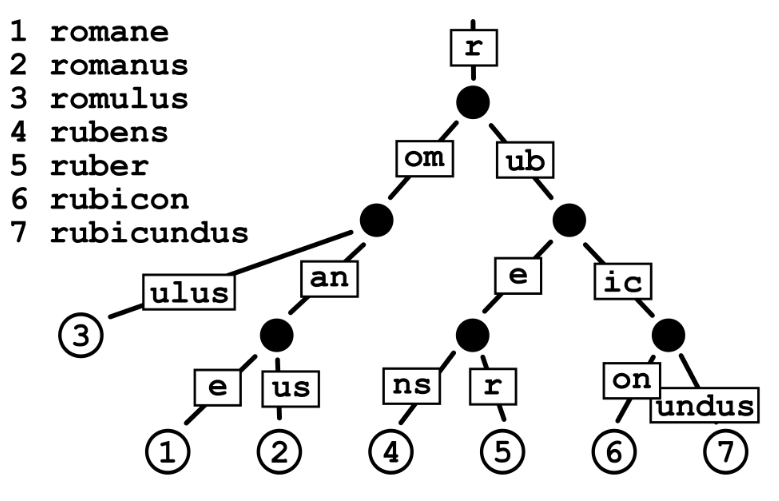

# 2주차 알고리즘 - 트라이

[toc]

## 트라이 (Trie)

1. [트라이 (Trie)](https://en.wikipedia.org/wiki/Trie) : 어원은 Tree Retrieval (트리 검색)

   - m-way tree의 검색 트리 일종. 일반적으로 키가 문자열인 동적  배열 혹은 연관 배열을 저장하는 데 사용되는 정렬된 트리 자료구조이다.
   - 자연어 처리 분야에서 주로 사용된다. 형태소 분석기에서 분석 패턴을 트라이로 만들어두고 자연어 문장에 대해 패턴을 찾아 처리하는 등으로 활용하고 있다. 
   - 트리 모양의 [deterministic finite automation](https://en.wikipedia.org/wiki/Deterministic_finite_automaton)이라고 생각할 수 있다. (state diagram 비슷한 느낌인듯?)
   - Left-child right-sibling binary tree를 채택한다.

2. 트라이를 왜 사용해야 하는가? 

   - `일일이 비교` : 길이 m인 문자열 n개의 집합에서 길이 m인 임의의 문자열을 찾고자 할 때, 일일이 확인하면 O(mn)이 걸려 비효율적이다.
   - `이진 탐색` : 길이 m인 문자열 n개의 집합에서 길이 m인 임의의 문자열을 찾고자 할 때, 이진 탐색은 O(m logn) 까지 줄일 수 있다. 하지만 정렬과정 자체에 O(nm logn)의 시간이 걸리므로 비효율적이다.
     - 이진탐색의 시간 복잡도는 O(logn) 이지만, 한 노드에 방문할 때마다 문자열 길이 m에 대해 비교해야하기 때문에 O(m logn)이 된다.
   - `해시 테이블` : 시간복잡도 O(1) 이지만, 공간복잡도가 O(단어의 개수) 만큼 필요하기 때문에 비효율적
     - 트라이를 사용하면 키 충돌이 없다. 불완전한 해시 테이블처럼 키 충돌 걱정할 필요 X
   - `트라이` : 길이 m인 임의의 문자열에 대해 Insert: O(m) , Find: O(m)
     - 해시테이블보다 시간 복잡도는 별로지만 좋은 편이고, 공간복잡도는 더 좋음

   

3. 트라이 python 구현 

   ```python
   # 파이썬 알고리즘 인터뷰 코드
   
   class TrieNode:
       def __init__(self):
           self.word = False
           self.children = collections.defaultdict(TrieNode)
           
   class Trie:
       def __init__(self):
           self.root = TrieNode()
       
       # 단어 삽입
       def insert(self, word:str) -> None:
           node = self.root
           for char in word:
               node = node.children[char]
           node.word = True
       
       # 단어 존재 여부 판별
       def search(self, word:str) -> bool:
           node = self.root
           for char in word:
               if char not in node.children:
                   return False
               node = node.children[char]
           return node.word
       
       # 문자열로 시작 단어 존재 여부 판별
       def startsWith(self, prefix:str) -> bool:
           node = self.root
           for char in prefix:
               if char not in node.children:
                   return False
               node = node.children[char]
           return True
   ```

4. 트리의 표현법

   - N-link Expression (N 링크 표현법)

     - 노드에 n개의 링크를 두고 모든 자식을 링크에 연결한다. (n은 자식 수와 관계 없음. 정적 할당)
     - 장) LCRS보다 시간복잡도가 우수함 & 단) 구현 복잡. 자식 개수가 고정(정적 배열. 동적 배열 써도 되는데 더 복잡해짐)
     - 임의의 노드 자식수를 n, 전체 데이터 수를 m 이라고 할 때 시간복잡도
       - Add: O(1) , search: O(m) , Delete: 자바 O(1) or C/C++ O(m) , Change: O(1)

     

   - Left-child right-sibling Expression (LCRS, 왼쪽자식 오른쪽형제 표현법)

     - 각 노드를 `데이터|가장 왼쪽 child의 주소|바로 오른쪽 sibling의 주소` 의 형태로 표현
     - 장) 구현이 쉬워서 N링크 표현법보다 많이 씀. & 단)  부모 노드에서 자식 노드로 한 번에 갈 수 없음.
     - 이러한 경우에 LCRS가 선호된다.
       - 메모리 효율성이 문제일 때 (데이터 양이 많은 large multi-way trees)
       - 노드의 자식 요소에 임의 접근이 필요 없을 때 (트리 구조가 구체적인 방법으로 사용되는, 전문화된 데이터)
     - 임의의 노드 자식수를 n, 전체 데이터 수를 m 이라고 할 때 시간복잡도
       - Add: O(n) , search: O(m) , Delete: 자바 O(1) or C/C++ O(m) , Change: O(1)
     - 우리가 배운 이진 트리 역시 이 표현법에 속한다.

     

5. 기타

   - 트리

     - [Ternary search tree](https://en.wikipedia.org/wiki/Ternary_search_tree)

     - [Red–black tree ★](https://en.wikipedia.org/wiki/Red%E2%80%93black_tree)

     - [Radix tree 혹은 compact prefix tree, 기수트리](https://en.wikipedia.org/wiki/Radix_tree)

       

     - [B-tree ★]() : m-ary search tree

   - 트라이

     - [X-fast trie](https://en.wikipedia.org/wiki/X-fast_trie)
     - [Y-fast trie](https://en.wikipedia.org/wiki/Y-fast_trie)
     - Bitmap Trie
     - bitwise trie
     - [DAFSA](https://en.wikipedia.org/wiki/Deterministic_acyclic_finite_state_automaton) : 트라이에서 같은 알파벳을 묶어서 압축시킴


## 2주차 모의고사 - BOJ

1. [BOJ 17070 파이프옮기기1](https://www.acmicpc.net/problem/17070)

2. 1시간 30분 푼 결과 : pass
   - 읽기/구상 15m & 코드 작성 35m & 수정 20m : total 70m
     - 문제 이해를 빨리하도록 노력하기
     - 한 번에 통과할 수 있도록 꼼꼼히 작성하기
   - 풀이 전략 : DP (특별한 조건이 없으며 오른쪽, 아래로만 확장됨)
   - fail 원인 : 출력 조건을 고려하지 못함
     - 이동시킬 수 없는 경우 (오른쪽 맨 아래 마지막 위치가 막혀있을 수 있음) 을 고려하지 못함
     - 이동시킬 수 없는 위치를 -1로 파싱했는데, 마지막 위치가 이동할 수 없는 위치면 sum(-1) 을 하게 되어 typeError 가 발생
   - 아쉬운 점 : 급박하게 작성하느라 코드가 매우 더러움
   
3. rank 코드
   - 풀이 전략 : DP
   
   ```python
   if maps[y][x] == maps[y][x-1] == maps[y-1][x] == 0:
       pass
   # 이런 식으로 작성할 수 있다는 것도 알아두기!
   ```
   
4. 기타 코드
   - 백트래킹(BFS, DFS)으로 풀 수 있음

