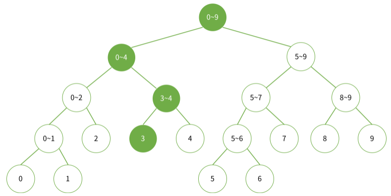

# 3주차 알고리즘 - 세그먼트 트리

[toc]

## 파이썬 알고리즘 인터뷰 ~ 6장

### 1장. 코딩 인터뷰

- 코딩 인터뷰란? 오프라인 면접장에서 화이트보드를 이용해 후보자의 기술 지식, 코딩 능력, 문제 해결 역량, 창의성 등을 테스트 하는 것을 말한다.
- 자신만의 코드 스니펫 준비 : 코딩 테스트 시 자주 쓰이는 동작들에 대해서는 코드 스니펫을 미리 만들어두면 도움이 된다. 예를 들어 연결 리스트를 뒤집거나 삭제하는 등의 작업들은 갑자기 구현하려고 하면 헷갈리기도 하고 시간도 제법 소요되는 편인데, 이런 작업에 대한 코드를 빠르게 가져올 수 있도록 코드 스니펫을 사전에 만들어두면 좋다. 로컬 컴퓨터나 **깃허브 기스트**를 활용하자.
- REPL 도구로 코드를 검증하자 : REPL은 사용자가 입력한 프로그램을 읽고, 값을 계산한 다음 출력하는 일을 반복하는 구조를 뜻하는 read-eval-print loop의 약어로서 사용자 입력에 대한 실행 결과를 바로 되돌려 주는 상호작용 환경을 말한다. (IDLE, jupyter notebook같은 느낌?) 보통 셸 형태로 제공되며, 파이썬은 이미 오래전부터 python을 파라미터 없이 실행하면 즉시 REPL 환경을 제공해왔다. TDD로 접근이 어려운 코딩 테스트에서 REPL 환경은 print()와 함께 가장 자주 쓰이는 디버깅 기능이기도 하며, 즉시 실행할 수 있다는 점에서 모호한 알고리즘을 바로 검증할 수 있어 버그를 줄이는 데 많은 도움이 된다.  


### 2장. 프로그래밍 언어 선택

- 제네릭 프로그래밍 : 제네릭(generic)이란 파라미터의 타입이 나중에 지정되게 해서 재활용성을 높일 수 있는 프로그래밍 스타일로서, 1989년 데이비드 무저와 알렉산더 스테파노프가 고안했다. 특히 알렉산더 스테파노프는 C++ STL의 창안자로도 유명하다. 

  - 파이썬은 원래 동적 타이핑 언어이기 때문에 제네릭이 필요 없다. 하지만 동적 타이핑의 장점이자 단점은 얼핏 사용하기엔 매우 편하지만 코드의 복잡도가 높아질수록 혼란을 가중시킨다는 점이다. **타입을 아예 명시하지 않으면 가독성을 낮추고 버그 발생 확률이 높아진다. 이후, PEP484(python 3.5+)에 추가된 타입 힌팅을 통해 제네릭을 사용할 수 있게 됐다.**
  - `mypy`를 사용하면 **타입 힌트에 오류가 없는지 자동으로 확인**할 수 있다.

  ```shell
  # mypy는 pip로 설치할 수 있다. 온라인 코딩 테스트에 활용해보자
  $ pip install mypy
  ```

- 구조체 : 파이썬에는 구조체가 없을 뿐더러 클래스 또한 데이터 타입을 지정할 수 없어 구조체와 같은 형태를 정의하려면 **네임드 튜플**을 사용해야 했다. 이처럼 정의해 사용하는 방법 밖에 없었는데, 파이썬 3.7부터는 **dataclass**를 지원하며 **@dataclass** 데코레이션으로 타입 힌트와 함께 활용함으로써 다음과 같이 class를 이용해 구조체 형태로 정의할 수 있다.

  ```python
  # 파이썬 3.7+
  # 3.6이하에서 사용하려면 pip install dataclasses
  from dataclasses import dataclass
  
  @dataclass
  class Product:
      weight: int = None
      price: float = None
          
  apple = Product()
  apple.price = 10
  ```

- 유연한 언어인가? C++와 자바는 대표적인 **정적 타이핑 언어로 매번 자료형을 엄격하게 선언해야한다. ** 대규모 프로젝트에서 이런 엄격함은 윶지 보수와 가독성을 높이는 데 매우 큰 도움이 된다. 하지만 단순히 알고리즘을 빠르게 구현해야하는 코딩 테스트에서 이런 엄격함은 생산성을 상당히 저해하는 요인이 된다. 파이썬은 이러한 엄격함이 거의 없기 때문에, 다른 언어에 비해 파이썬은 압도적으로 유리한 지점에 있다.


### 3장. 파이썬

- 네이밍 컨벤션 : 파이썬의 변수명 네이밍 컨벤션은 자바와 달리 각 단어를 밑줄로 구분하여 표기하는 Snake Case를 따른다. 이는 함수명도 마찬가지다. 특히 파이썬은 파이썬다운 방식에 굉장한 자부심이 있어서, 카멜 케이스 뿐만 아니라 자바 스타일로 코딩하는 것을 지양한다.

  - snake_case & camelCase & PascalCase 

- `Generator` : 루프의 반복 동작을 제어할 수 있는 루틴 형태. 여러 타입의 값을 하나의 함수에서 생성하는 것도 가능하다. 예를 들어, 임의의 조건으로 숫자 1억 개를 만들어내 계산하는 프로그램을 작성한다고 가정해보자. **이 경우 제너레이터가 없다면 메모리 어딘가에 만들어낸 숫자 1억 개를 보관하고 있어야한다. 그러나 제너레이터를 이용하면, 단순히 제너레이터만 생성해두고 필요할 때 언제든 숫자를 만들어 낼 수 있다.**

  - `yield`구문을 사용하면 제너레이터를 리턴할 수 있다. 기존 함수는 return 구문을 맞닥뜨리면 값을 리턴하고 모든 함수의 동작을 종료한다. 그러나 **yield는 제너레이터가 여기까지 실행 중이던 값을 내보낸다는 의미로, 중간 값을 리턴한 다음 함수는 종료되지 않고 계속해서 맨 끝에 도달할 때까지 실행한다.**
  - `next()` 구문을 사용하면 제너레이터로 받은 값 중에서 다음 값을 가져올 수 있다. 

  ```python
  def generator():
      yield 1
      yield 'string'
      yield True
      
  g = generator()
  print(g)         # <generator object generator at 0x000002210CF104A0>
  print(next(g))   # 1
  print(next(g))   # 'string'
  print(next(g))   # True
  ```

- `range()` : 제너레이터 방식을 활용하는 대표적인 함수. for문에서 사용할 경우 내부적으로는 제너레이터의 next()를 호출하듯 매번 다음 숫자를 생성해내게 된다. 파이썬 2.x에서 range()는 리스트를 미리 생성해서 리턴하는 방식이었고, xrange()가 제너레이터를 활용하는 형식이었다. 이후 파이썬 3.x에서 range()가 제너레이터 역할을 하는 형태로 변경됐고 xrange는 사라졌다. 

  ```python
  # 똑같이 숫자를 갖고 있으나 range 클래스를 이용하는 b 변수의 메모리 점유율이 훨씬 작다.
  
  >>> a = [n for n in range(1000000)]
  >>> b = range(1000000)
  >>> len(a) == len(b)   # True
  >>> sys.getsizeof(a)   # 8697464
  >>> sys.getsizeof(b)   # 48
  ```

- `locals()` : **로컬 심볼 테이블 딕셔너리를 가져오는 메서드. 로컬 에 선언된 모든 변수를 조회할 수 있는 강력한 명령**이므로 디버깅에 도움이 된다. 로컬 스코프에 제한해 정보를 조회할 수 있어 클래스의 특정 메소드 내부에서나 함수 내부의 로컬 정보를 조회해 잘못 선언한 부분이 없는지 확인하는 용도로 활용된다.

  ```python
  ...
  import pprint
  pprint.pprint(locals())
  ...
  
  # 출력
  { 'nums': [2, 7, 11, 15],
  'pprint: <module 'pprint' from '~'>,
  'self': <__main__.Solution object at 0x~>,
  'target': 9 }
  ```


### 4장. 빅오, 자료형

- 빅오는 시간 복잡도 외에 공간 복잡도를 표현하는 데에도 널리 쓰인다. 알고리즘은 흔히 '시간과 공간의 트레이드 오프' 관계다. 실행 시간이 빠른 알고리즘은 공간을 많이 사용하고, 공간을 적게 차지하는 알고리즘은 실행 시간이 느리다는 얘기다.

- 빅오는 상한, 빅오메가는 하한, 빅세타는 평균을 의미한다. 학계와 달리 업계에서는 빅오와 빅세타를 하나로 합쳐 단순화해서 표현하려는 경향이 있다.

  - 상한을 최악의 경우와 혼동하는 경우가 있다. 빅오 표기법은 정확하게 쓰기에는 너무 길고 복잡한 함수를 적당히 정확하게 표현하는 방법일 뿐, **최악의 경우/평균적인 경우의 시간 복잡도와는 아무런 관계가 없는 개념**이라는 점에 유의해야한다.

  - 빅오 표기법은 복잡한 함수 fn이 있을 때, n이 작을 때(n0 이하일 때)는 무시하고 n이 매우 클 때의 전체적인 큰 그림에 집중한다. **주어진(최선/최악/평균) 경우의 수행 시간의 상한을 나타낸다.**

    

- 분할 상환 분석 : 시간 또는 메모리를 분석하는 알고리즘의 복잡도를 계산할 때, 알고리즘 전체를 보지 않고 최악의 경우만 살펴보는 것은 지나치게 비관적이라는 이유로 분할 상환 분석 방법이 등장했다.

- 병렬화 : 일부 알고리즘들은 병렬화로 실행 속도를 높일 수 있다. 최근 딥러닝의 인기와 함께 병렬화가 큰 주목을 받고 있으며 GPU는 병렬 연산을 위한 대표적인 장치이기도 하다. **GPU 각각의 코어는 CPU보다 훨씬 더 느리지만 GPU 코어는 수천여 개로 구성되어 있어, 많아봐야 수십여 개에 불과한 CPU보다 수백 배 더 많은 연산을 동시에 수행할 수 있다.** 

  - 알고리즘 자체의 시간 복잡도 외에 알고리즘이 병렬화가 가능한지는 근래에 알고리즘의 우수성을 평가하는 매우 중요한 척도 중 하나이기도 하다.

- 속도 : 파이썬의 객체 구조는 파이썬이 C나 자바 같은 다른 언어에 비해 느린 중요한 이유 중 하나이기도 하다. 단순히 정수형 덧셈 연산을 하는 경우에도 메모리에서 값을 꺼내 한 번 연산하면 끝인 원시타입에 비해, 파이썬의 객체는 값을 꺼내는 데만 해도 var->PyObject_HEAD에서 타입코드를 찾는 등 여러 단계의 부가 작업이 필요하다.

  - 파이썬의 과학 계산 모듈인 넘파이는 C로 만든 모듈이며 내부적으로 리스트를 C의 원시 타입으로 처리하기 때문에 빠른 속도를 갖는다.

- 자료구조, 자료형, 추상 자료형

  - 자료구조 : 데이터에 효율적으로 접근하고 조작하기 위한 데이터의 조직, 관리, 저장 구조. 원시 자료형을 기반으로 하는 배열, 연결 리스트, 객체 등
  - 자료형 : 컴파일러 또는 인터프리터에게 프로그래머가 데이터를 어떻게 사용하는지 알려주는 일종의 데이터 속성(Attribute)이다. 정수, 실수, 문자열 등 해당 언어에서 지원하는 원시 자료형까지 포함하는 모든 자료의 유형
  - 추상 자료형 (ADT) : 자료형에 대한 수학적 모델. 행동만을 정의할 뿐 실제 구현 방법은 명시하지 않는다는 점에서 자료구조와는 다르다. 


### 5장. 리스트, 딕셔너리

- 리스트

  - 단일 리스트 하나에 정수, 불리언, 문자 등 여러 자료형을 저장할 수 있다는 특징은 매우 강력하고 편리하다. 하지만 **각 자료형의 크기는 저마다 서로 다르기 때문에 이들을 연속된 메모리 공간에 할당하는 것은 불가능하다. 결국 각각의 객체에 대한 참조로 구현할 수 밖에 없다.** 당연히 인덱스를 조회하는 데에도 모든 포인터의 위치를 찾아가서 타입 코드를 확인하고 값을 일일이 살펴봐야 하는 등 추가적인 작업이 필요하기 때문에 속도 면에서 훨씬 더 불리하다.

  

  |      연산      | 복잡도 |     연산      |  복잡도   |      연산      | 복잡도 |
  | :------------: | :----: | :-----------: | :-------: | :------------: | :----: |
  |     len(a)     |  O(1)  |     a[i]      |   O(1)    |     a[i:j]     |  O(k)  |
  |   elem in a    |  O(n)  | a.count(elem) |   O(n)    | a.index(elem)  |  O(n)  |
  | a.append(elem) |  O(1)  |    a.pop()    |   O(1)    |    a.pop(0)    |  O(n)  |
  |    del a[i]    |  O(n)  |   a.sort()    | O(n logn) | min(a), max(a) |  O(n)  |

- 딕셔너리 : 키/값 구조로 이뤄진 딕셔너리. **파이썬 3.7+에서는 입력 순서가 유지된다.** 내부적으로 해시테이블로 구현되어 있다.

  - 딕셔너리의 키는 del로 삭제한다 : `del a['key1']`

  |      연산      | 시간 복잡도 |   연산   | 시간 복잡도 |
  | :------------: | :---------: | :------: | :---------: |
  |     len(a)     |    O(1)     |  a[key]  |    O(1)     |
  | a[key] = value |    O(1)     | key in a |    O(1)     |

  - 딕셔너리 모듈

  ```python
  # defaultdict : key가 없는 경우 디폴트 값을 기준으로 해당 키에 대한 값을 생성
  >>> a = collections.defaultdict(int)
  >>> a['A'] = 5
  >>> a['B'] = 4
  >>> a['C'] += 1
  >>> a 
  defaultdict(<class 'int'>, {'A': 5, 'B': 4, 'C': 1})
  
  
  # Count : 아이템에 대한 개수를 계산해 딕셔너리로 리턴
  >>> a = [1, 2, 3, 4, 5, 5, 5, 6, 6]
  >>> b = collections.Counter(a)
  >>> b
  Counter({5: 3, 6: 2, 1: 1, 2: 1, 3: 1, 4: 1})
  # 가장 빈도가 높은 요소 추출
  >>> b.most_common(2)
  [(5, 3), (6, 2)] 
  
  
  # OrderedDict : 입력 순서가 유지되는 객체 (파이썬 3.6이하에서 사용)
  >>> collections.OrderedDict({'banana': 3, 'apple': 4, 'pear': 1, 'orange': 2})
  OrderedDict([('banana', 3), ('apple', 4), ('pear', 1), ('orange', 2)])
  ```


### 6장. 문자열 조작

- 유효한 팰린드롬
- 문자열 뒤집기
- 로그 파일 재정렬
- 가장 흔한 단어
- 그룹 애너그램
- 가장 긴 팰린드롬 부분 문자열


## 세그먼트 트리

### 1. 세그먼트 트리 (Segment Tree)

1. [segment tree](https://www.acmicpc.net/blog/view/9) 문제

   ```
   배열 A가 있고, 다음과 같은 두 연산을 수행해야하는 문제를 생각해보자
   1. 구간 l, r(l <= r)이 주어졌을 때, A[l]+A[l+1]+...+A[r-1]+A[r]을 구해서 출력하기
   2. i번째 수를 v로 바꾸기, A[i]=v
   수행해야 하는 연산은 최대 M번 입니다.
   ```

   - 시간 복잡도 : O(NM) + O(M) = O(NM)
     - 1번 연산은 수행하는데 O(N), M번 수행하기 위해서는 O(NM).
     - 2번 연산은 수행하는데 O(1), M번 수행하기 위해서는 O(M). 
   - 2번 연산이 없다고 가정하면, 차례대로 합을 구해놓는 방법을 사용할 수 있다. S[i] = A[1]+...+A[i]라고할 때, i~j합은 S[j]-S[i-1]이 된다. 다시 2번 연산을 하려면, 수가 바뀔 때마다 S를 변경해야한다. 가장 앞에있는 0번째 수가 바뀐 경우에는 모든 S배열을 변경해야하기 때문에 시간 복잡도는 O(N)이 걸리게 된다.
   - 세그먼트 트리를 사용하면 1번, 2번 연산을 O(lgN)으로 수행할 수 있다.

2. segment tree : 일차원 배열에서 특정 구간에 대한 합을 계산

   - 완전 이진 트리. 완성된 세그먼트 트리의 모든 레벨은 마지막 레벨 (리프 노드) 부분을 제외하고 완벽히 채워지게 된다. 

   - 트리의 높이가 logN 이기 때문에 쿼리, 업데이트 하는 데에 시간이 별로 안 걸린다.

   - 리프노드는 배열의 수 그 자체. 다른 노드들은 왼쪽 자식과 오른쪽 자식의 합

     

   - 합 구하기

     - 2~4 까지의 합

       

     - 3~9 까지의 합

       

   - 수 변경하기 : 그 숫자가 포함된 구간을 담당하는 노드를 모두 변경

     - 3번째 수를 변경

       

3. 파이썬 코드 구현

   ```python
   # 추가 예정..
   ```

   


### 2. 펜윅 트리 (Fenwick Tree, Binary Indexed Tree, BIT)

1. [펜윅 트리](https://www.acmicpc.net/blog/view/21)

   - 펜윅 트리를 구현하려면, 어떤 수를 이진수로 나타냈을 때 마지막 1의 위치를 계산해야한다. `L[i] = i & -i`
   - 세그먼트 트리를 응용한 자료구조. 세그먼트 트리와는 다르게 모든 세그먼트를 만들 필요가 없어 메모리도 절약되고, 코드도 더 간결하다. 단, 세그먼트 트리와 다르게 최솟값, 최댓값은 찾지 못한다.

   

   - 합 구하기 : **마지막 1의 위치를 빼면서** 찾을 수 있다.

     - 13 = 1101(2) 이므로, A[1] + ... + A[13] = Tree[1101] + Tree[1100] + Tree[1000]이 된다.

     

   - 변경 : 어떤 수를 변경할 땐 그 수가 담당하는 구간 모두를 업데이트. **마지막 1의 위치에 1을 더하는 방식**으로 구현할 수 있다. 

     - 아래 그림은 i를 변경했을 때, 바꿔줘야하는 Tree[i]를 나타낸 것이다.
     - 13(1101)번 인덱스를 업데이트 한다고 하면, 14(110**1**+1=1110)번, 16(11**1**0+10=10000)번을 업데이트 해야한다.

     

2. 파이썬 코드 구현

   ```python
   # 출처 https://www.youtube.com/watch?v=fg2iGP4e2mc
   
   n = 17
   arr = [0, 3, 2, 5, 7, 10, 3, 2, 7, 8, 2, 1, 9, 5, 10, 7, 4]
   tree = [0] * n
   
   # i번째 수 까지의 누적 합을 계산하는 함수
   def prefix_sum(i):
       result = 0
       while i > 0:
           result += tree[i]
           i -= (i & -i)    # 마지막 1을 빼가면서 이동
       return result
   
   
   # i번째 수를 dif만큼 더하는 함수
   def update(i, dif):
       while i <= n:
           tree[i] += dif
           i += (i & -i)    # 마지막 1을 더하면서 이동
   
           
   # start부터 end까지의 구간 합을 계산하는 함수
   def interval_sum(start, end):
       return prefix_sum(end) - prefix_sum(start - 1)
   
   
   # 트리 만들기
   for i in range(1, n):
       update(i, arr[i])
       
   # 13번 인덱스를 업데이트하기
   update(13, 2)
   ```
   


### 3. 기타

1. [세그먼트 트리 BOJ 문제집](https://www.acmicpc.net/step/35)


## 3주차 모의고사 - BOJ17406

1. [BOJ17406](https://www.acmicpc.net/problem/17406) 배열 돌리기 4
2. 1시간 30분 푼 결과 : pass
   - 읽기/구상 15m & 코드 작성 60m : total 75m
     - drc 시계 방향으로 순회하는 코드 구현이 바로 떠오르지 않아서 버벅임 (연습 필요)
     - 문제 자체는 간단하고, 구상한 코드도 맞는데 디테일한 코드 구현을 하는 데 시간이 지체됨
   - 풀이 전략 : 완전 탐색 (input의 크기가 별로 크지 않아서 괜찮을 것이라고 판단)
3. rank 코드
   - itertools의 permutations을 활용해서 회전시키기
   - DFS로 방문 체크를 활용, 순열의 중복된 부분은 반복회전 시키지 않기 ★

