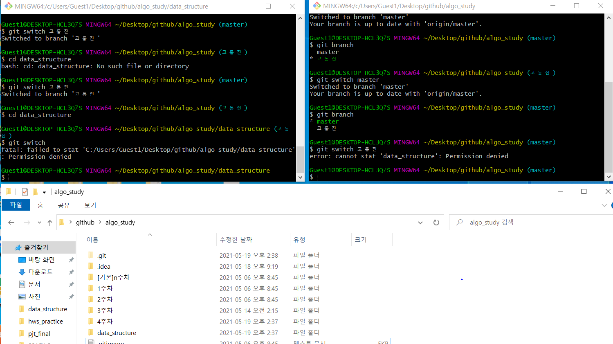

# 자료구조와 알고리즘을 통한 버전관리 연습

여러 자료구조와 알고리즘 파이썬 파일을 만들고 공동관리하면서 발전사항을 수정한 뒤에 git repository에 올린다.


## 방법

1. 최신 버전을 다운 받는다.

```bash
git pull origin 고동진
```

2. 변경할 파일의 branch를 생성한다.

```bash
git switch -c feature/file_or_function
// or
git branch // ??
git switch feature/file_or_function
```

3. 수정사항을 add commit 후에 git repository에 push한다.

   (pr 하면서 상세사항을 작성하거나 bash에서 작성 명령어 추가바람)

```bash
git add
git commit -m "create, first, fixed, modified, 더 기재 바람"
git push origin feature/file_or_function
```

4. PR을 한뒤 여러 merge 상황을 살펴보고 case 별로 정리를 한다.
5. merge가 끝나면 git pull을 받아 버전을 일치시켜준다.

```bash
git pull origin 고동진
```

6. feature/file_or_function branch가 고동진에 반영됬으므로 branch를 제거한다.

```bash
git branch -d feature/file_or_function
```


## 충돌사항(confilcts)과 해결 과정 정리(git merge)

### Case

1. 부모 branch를 pull 받지 않고 local에서 자식 branch를 삭제하려고 하면 경고를 보내준다.

   ```bash
   git branch -D feature/file_or_function
   ```

   `-d` 말고 `-D` 옵션을 주면 강제 삭제가 가능하다.

   

2. ```bash
   error: cannot stat 'file directory': Permission denied
   ```



검색 결과 일반적인 경우는 permission denied(Publickey)인 경우로 

**등록되지 않은 기기**에서 clone이나 push가 일어나면 인증문제가 발생하게 된답니다.

결과적으로 **유저의 ssh가 등록되지 않아 접근권한이 없어서 나오는 문제**에요.

출처: https://zeddios.tistory.com/120 [ZeddiOS]

이 경우와는 다르다.

문제점 발생: bash에서 키고 새 branch에서 mkdir로 해당 directory로 이동하고 새 bash창을 키고 master branch로 이동하면 문제가 발생한다.

생각: 두 개의 bash는 동기화 되는데 master에는 없는 경로에 bash가 열려있어서 오류가 생기는 것으로 추측된다.

해결법:

1. 새로 만든 경로를 가리키고 있는 bash에서 cd ../ 를 통해서 나와준다.
2.  새로 만든 경로를 가리키고 있는 bash창을 종료한다.

