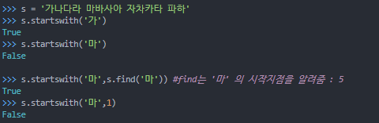

# 5052 전화번호 목록 G4

1. 알고리즘 분류

   - 자료 구조
   - 문자열
   - 정렬
   - 트리
   - 트라이

2. 문제

   전화번호 목록이 주어진다. 이때, 이 목록이 일관성이 있는지 없는지를 구하는 프로그램을 작성하시오.

   전화번호 목록이 일관성을 유지하려면, 한 번호가 다른 번호의 접두어인 경우가 없어야 한다.

   예를 들어, 전화번호 목록이 아래와 같은 경우를 생각해보자

   - 긴급전화: 911
   - 상근: 97 625 999
   - 선영: 91 12 54 26

   이 경우에 선영이에게 전화를 걸 수 있는 방법이 없다. 전화기를 들고 선영이 번호의 처음 세 자리를 누르는 순간 바로 긴급전화가 걸리기 때문이다. 따라서, 이 목록은 일관성이 없는 목록이다. 

3. 입력

   첫째 줄에 테스트 케이스의 개수 t가 주어진다. (1 ≤ t ≤ 50) 각 테스트 케이스의 첫째 줄에는 전화번호의 수 n이 주어진다. (1 ≤ n ≤ 10000) 다음 n개의 줄에는 목록에 포함되어 있는 전화번호가 하나씩 주어진다. 전화번호의 길이는 길어야 10자리이며, 목록에 있는 두 전화번호가 같은 경우는 없다.

4. 출력

   각 테스트 케이스에 대해서, 일관성 있는 목록인 경우에는 YES, 아닌 경우에는 NO를 출력한다.

## 1. 내 풀이

1. 시간

   - PyPy3기준/412ms
   - Python3 기준(realine) / 212ms

2. 풀이

   - 숫자로 형변환 하지 않고 정렬하면 바로 다음 숫자만 체크해도 된다.

3. 어려웠던 점 / 아쉬운 점

   - realine으로 읽어왔을 때 오류가 뜨는 걸 해결하지 못해서 PyPy3으로 일단 제출했다. realine에 좀 익숙해져야할 필요가 있다.

4. 코드

   ```python
   import sys
   
   T = int(input())
   
   for tc in range(1, T+1):
       n = int(input())
       numbers = [input() for _ in range(n)]
       numbers.sort()
       # 숫자로 바꾸지 않는게 키포인트
       # 숫자 크기로 정렬되는게 아니라, 각 자리의 유니코드 값으로 정렬
       # 따라서 목록이 일관성 있으려면 바로 다음 숫자만 확인하면 됨
       answer = 'YES'
       for i in range(n-1): # numbers 순회
           mylen = len(numbers[i]) # 지금 기준이 되는 numbers의 길이
           if numbers[i+1][:mylen] == numbers[i]: # 앞에서부터 세서 잘랐을때 같으면
               answer = 'NO'
               break # 탈출!
   
   
       print(answer)
   ```

   ```python
   import sys
   input = sys.stdin.readline
   
   T = int(input().strip())
   
   for tc in range(1, T+1):
       n = int(input().strip())
       numbers = [input().strip() for _ in range(n)]
       numbers.sort()
       answer = 'YES'
       for i in range(n-1): 
           mylen = len(numbers[i]) 
           if numbers[i+1][:mylen] == numbers[i]: 
               answer = 'NO'
               break 
   
   
       print(answer)
   ```

   

## 2. 다른 사람 풀이

### 2.1 henrylab

1. 시간

   - 176ms

2. 코드

   ```python
   import sys
   r = sys.stdin.readline
   
   def solve(book):
       for p1, p2 in zip(book, book[1:]):
           if p2.startswith(p1): #startswith
               return False      
       return True
   
   T = int(r())
   for _ in range(T):
       N = int(r())
       flag = True
       book = []
       for _ in range(N):
           book.append(r().strip())
   
       book.sort()
       if solve(book):
           print("YES")
       else:
           print("NO")
   
   ```

   

3. 비교

   - `startswith(시작 문자, 시작지점)`

     문자열이 특정 문자로 시작하는지 여부를 알려준다. true나 false를 반환.

     

