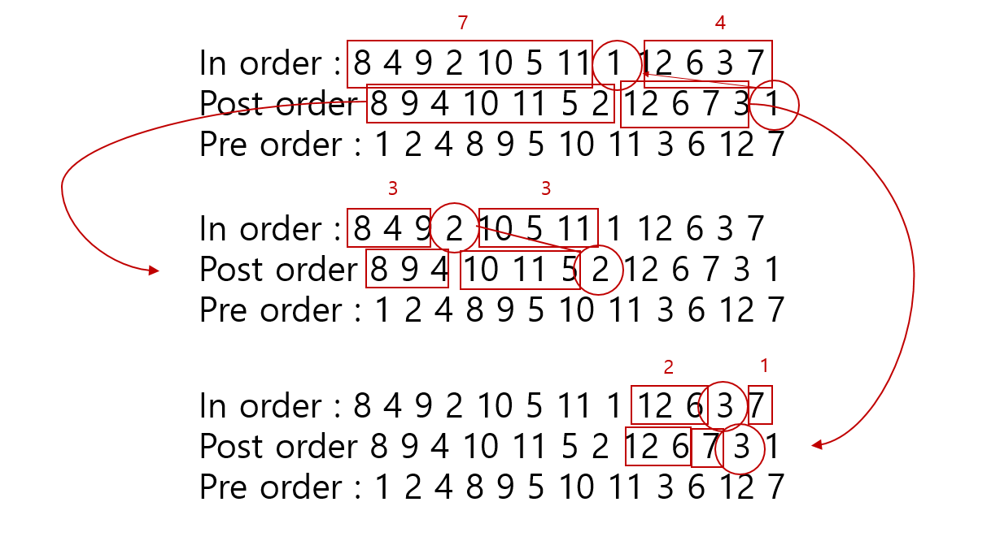

### 내 풀이

1. 이렇게 푼 이유?

   - inorder, postorder 규칙 적용

   - 처음에는 pre order 까먹어서 다르게 구했다가 블로그 참고

   - 그림 참고, 분할정복으로 해결

     

2. 실행시간

   - 384ms (python)

3. 코드

   ```python
    # pre order는 부모 -> 왼쪽 -> 오른쪽
    # 포스트 오더에서는 맨뒤에 루트가 온다
    import sys
    sys.stdin = open('input.txt')
    sys.setrecursionlimit(10**6)
    
    n = int(input())
    inOrder = list(map(int, input().split())) # 왼쪽 -> 부모 -> 오른쪽
    postOrder = list(map(int, input().split())) # 왼쪽 -> 오른쪽 -> 부모
    
    tree = [0] * (n+1)
    
    for i in range(n):
        tree[inOrder[i]] = i
    
    def devide(in_start, in_end, post_start, post_end):
    
        if in_start > in_end or post_start > post_end:
            return
    
        parents = postOrder[post_end]
        print(parents, end=" ")
    
        left = tree[parents] - in_start
        right = in_end - tree[parents]
    
        devide(in_start, in_start + left -1, post_start, post_start + left - 1)
        devide(in_end - right + 1, in_end, post_end - right, post_end - 1)
    
    
    devide(0, n-1, 0, n-1)
   ```


### 다른 사람의 풀이

1. 실행시간

   - 188ms / pbh0403

2. 코드

   ```python
    # BOJ 2263 Tree Traversal
    import sys
    input = sys.stdin.readline
    
    N = int(input())
    inorder = input().split()
    postorder = input().split()
    
    
    def preorder(n, mid, post):
        res = []
        queue = [[0, n-1, 0, n-1]]
        loc = {mid[i]: i for i in range(n)}
        while queue:
            # l r for inorder, s e for postorder index
            l, r, s, e = queue.pop()
            root = post[e]
            root_loc = loc[root]
            res.append(root)
            l_size = root_loc-l
            if 0 <= root_loc < r:
                queue.append([root_loc+1, r, s+l_size, e-1])
            if 0 <= l < root_loc:
                queue.append([l, root_loc-1, s, s+l_size-1])
        return res
    
    
    print(' '.join(preorder(N, inorder, postorder)))
   
3. 해설

   - 분할 정복을 재귀가 아닌 반복문으로 구현 함, 써놓기는 queue 라고 써놨는데 스택으로 사용함.
   - 왼쪽 자식들부터 봐야되기 때문에 아래있는 조건문이 왼쪽 절반을 의미