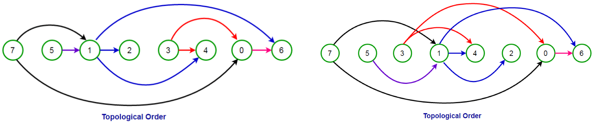

### 우선순위 큐

우선 순위 큐는 말 그대로 우선순위가 있는 큐이다. 큐는 들어온 순서로 나가는 선입선출 구조이고, 우선순위 큐는 들어온 순서에 관계 없이 우선순위가 높은 순서로 나오는 자료구조이다. 우선순위큐는 힙으로 구현할 수 있다. 우선순위라는 것 자체가 어떤 값이 크거나 작은 순서이기 때문에 힙으로 구현하기 좋다. 힙을 사용하면 배열이나 연결리스트를 사용하는 것보다 원소의 삽입, 삭제, 저장이 용이하다.


### 위상정렬

**위상 정렬**(topological sorting)은 [유향 그래프](https://ko.wikipedia.org/wiki/유향_그래프)의 꼭짓점들(vertex)을 변의 방향을 거스르지 않도록 나열하는 것을 의미한다.

#### 1. 특징



하나의 방향 그래프에는 여러 위상 정렬이 가능하다.
위상 정렬의 과정에서 선택되는 정점의 순서를 위상 순서(Topological Order)라 한다.
위상 정렬의 과정에서 그래프에 남아 있는 정점 중에 진입 차수가 0인 정점이 없다면, 위상 정렬 알고리즘은 중단되고 이러한 그래프로 표현된 문제는 실행이 불가능한 문제가 된다.

#### 2. 방법


1. 진입 차수가 0인 정점(즉, 들어오는 간선의 수가 0)을 선택
   - 진입 차수가 0인 정점이 여러 개 존재할 경우 어느 정점을 선택해도 무방하다.
   - 초기에 간선의 수가 0인 모든 정점을 큐에 삽입
2. 선택된 정점과 여기에 부속된 모든 간선을 삭제
   - 선택된 정점을 큐에서 삭제
   - 선택된 정점에 부속된 모든 간선에 대해 간선의 수를 감소
3. 위의 과정을 반복해서 모든 정점이 선택, 삭제되면 알고리즘 종료

[위 설명 출처](https://gmlwjd9405.github.io/2018/08/27/algorithm-topological-sort.html)


### 풀이

1. 이렇게 푼 이유?

   - 부모 자식을 구해야할 것 같아서 유니온 파인드 했는데 틀려서, 위상 정렬 공부하고 블로그 참고함
   - 맞은 사람중에 가장 빠른 코드랑 동일한데 시간차이가 좀 난다. 이유는 모르겠음. 다른건 lambda

2. 실행시간

   - 260ms (python)

3. 코드

   ```python
   import sys
   from heapq import heappush, heappop
   
   sys.stdin = open('input.txt')
   q = lambda: map(int, sys.stdin.readline().split())
   
   # input
   N, M = q()
   
   next_problem = [[] for _ in range(N+1)] # 다음에 풀 문제
   pre_problem_cnt = [0] * (N+1) # 문제별 선수 문제의 수(위상)
   heap = []
   
   # init
   for _ in range(M):
       A, B = q()
       next_problem[A].append(B)
       pre_problem_cnt[B] += 1
   
   
   # 선수문제가 없는 문제 구하기
   for i in range(1, N+1):
       if pre_problem_cnt[i] == 0:
           heap.append(i) # 여기선 어차피 앞에서부터 추가해서 heappush랑 같고 더 빠름
   
   
   # 정렬 & 출력
   while heap:
       problem = heappop(heap) # 문제 번호 작은 순(최소힙)
       print(problem, end=" ")
   
       for np in next_problem[problem]:
           pre_problem_cnt[np] -= 1
           if pre_problem_cnt[np] == 0:
               heappush(heap, np)
   ```
