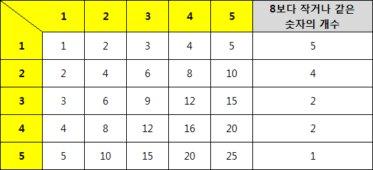

### 내 풀이

1. 이렇게 푼 이유?

   - 처음에 못풀어서 블로그를 참고했다.
   - 신기한 점은 동일한 로직임에도 불구하고, 재귀/반복에 따라, python/pypy에 따라 시간차이가 굉장히 크게 나타났다.

2. 코드

   1. 반복 + 반복 (python : 1060ms / pypy: 176ms)
   2. 재귀 + 재귀 (python : 828ms / pypy: 160ms)
   3. 재귀 + 반복 (python : 804ms / pypy: 160ms)

   ```python
   import sys
   sys.stdin = open('input.txt')
   input = sys.stdin.readline
   
   N, k = int(input()), int(input())
   l, r = 1, k #point①
   result = 0
   
   def getCnt(m):
       cnt = 0
       for i in range(1, N + 1):
           cnt += min(N, m // i) #point②
   
       return cnt
   
   def binarySearch(l, r):
       while l <= r:
           m = (l + r) //  2
   
           if getCnt(m) >= k :
               r = m-1
           else:
               l = m+1
       return l #point③
   
   print(binarySearch(l, r))
   ```

3. 해설

   - 이진 탐색에서는 어떤 값을 탐색의 시작값, 끝값으로 두는지가 가장 중요하다. 이 문제에서는 k번째로 등장 할 수 있는 수를 찾는것이기 때문에, 등장가능한 수의 범위를 l,r로 잡는다. 문제의 2차원 배열을 1차원으로 만드는 것이므로, 2차원 배열의 원소중 가장 작은 1*1 = 1을 l, N^2을 r로 잡는 것이다.

   - point① : 하지만 여기서는 r을 k로 잡았다. N^2으로 잡아도되지만, k로 잡는 것이 빠르다. k로 잡을 수 있는 이유는 k번째로 등장하는 수는 반드시 k보다 작거나 같다. [1,2,3] [2,4,6] [3,6,9] 이런식으로 이차원 배열이 만들어지기 때문에 중복되는 값들이 생긴다. 1을 제외하고 나머지 숫자들은 k번째 등장 수가 k보다 작다. 순서대로 나열하면 1,2,2,3,3,4,6,9 이런식이기 때문.

   - point② : 블로그에 이해하기 좋은 이미지가 있어서 참고함. 아래처럼 2차원 배열의 시작은 1,2,3~ 정수이고, 그 수들의 배수로 N개가 있는 식으로 구성된다. 그렇기 때문에 여기서 m보다 작은 수의 값을 세는 방법은 다음과 같다. `m // i` =  행번호의 배수중에 m보다 작은것, 나누어 떨어지는 것의 갯수

     

   - point③ : 리턴값은 최종적으로 교차되었을때의 lower bound인 l이다. 예제에서 N=3, k=7일때 위와 같은 방식으로 찾으면 m이 6일때도, 7일때도, 8일때도 cnt는 모두 8로 동일하다. 만약 cnt가 원하는 k보다 작다면 그것은 자명하게 m을 키워야된다고 판단할 수 있지만, 큰 경우에는 그렇지 않다. 또한 일반적으로 m==k인 조건을 줄수도 없다. 예제도 그렇게 구해서는 답이 나오지 않는다. 이럴때는 보통 lower bound, upper bound를 구하는 식으로 접근하는게 일반적이다. 답이 될수 있는 여러개의 후보중에서 가장 작은것 or 큰것을 택한다.


### 다른 사람의 풀이

1. 실행시간

   - 156ms (pypy)

2. 코드

   ```python
   def parametric_search_max(f, left, right):
       ans = 0
       while left < right:
           middle = (left + right) // 2
           if f(middle):
               ans = max(ans, middle)
               left = middle + 1
           else:
               right = middle
   
       if f(left):
           ans = max(ans, left)
   
       return ans
   
   
   def check(N, K, n):
       count = 0
       for i in range(1, N + 1):
           count += min((n - 1) // i, N)
       if count < K:
           return True
       else:
           return False
   
   
   N = int(input())
   K = int(input())
   print(parametric_search_max(lambda x: check(N, K, x), 1, min(int(1e9), N*N)))
   ```
   
3. 해설

   - 위와 동일하고 여기서는 upper bound를 사용함. `min((n - 1) // i, N)`를 구할때 작거나 같은게 아니라 그 수보다 진짜 작은 수들의 갯수만 센다. 그게 이미 k보다 큰 경우에는 숫자를 줄이기만한다.
   - k보다 작다면 이숫자가 k번째에 등장하는 수 일수도 있으니, 후보로 등록한다.
   - 디버깅을 해보면 예제의 경우 m = 5일때 5보다 작은 수가 6개이다. 6은 k(=7)보다 작으니, 7번째로 5가 나올수도 있으니 일단 ans를 5로 갱신한다. 이후에 반복을 거쳐 m=6일때 마찬가지로 count가 6이라, ans는 5보다 큰 6이 지정된다.
   - 즉, 여기서는 m보다 작은 수가 (k-1) 개인 수들 중에서 가장 큰 수를 upper bound로 잡는 것이다.