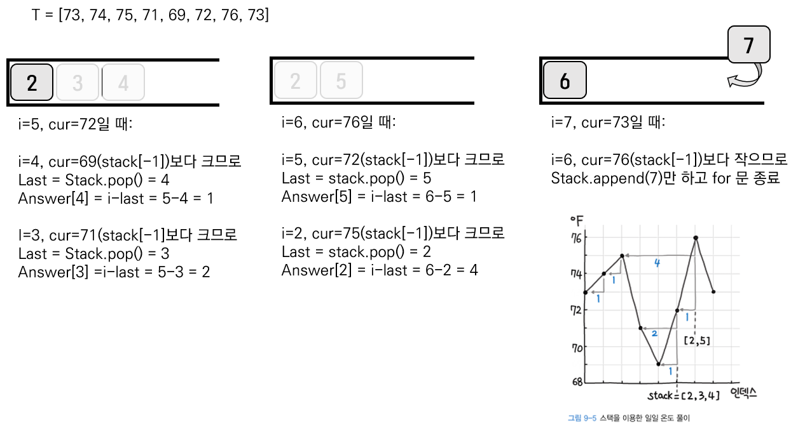
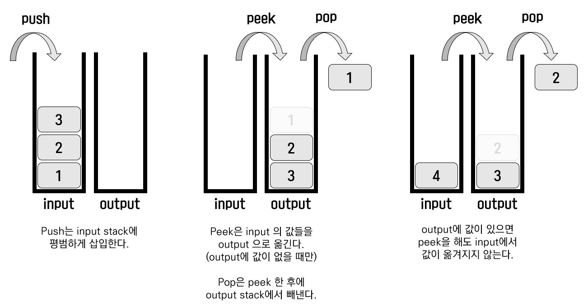

# 6주차 알고리즘 - 스택 & 큐

[toc]

## 스택

1. 중복 문자 제거

   ```python
   import collections
   
   class Solution:
       def removeDuplicateLetters(self, s: str) -> str:
           counter, seen, stack = collections.Counter(s), set(), []
   
           for char in s:
               counter[char] -= 1
               if char in seen:
                   continue
               # 뒤에 붙일 문자가 남아 있다면 스택에서 제거
               while stack and char < stack[-1] and counter[stack[-1]] > 0:
                   seen.remove(stack.pop())
               stack.append(char)
               seen.add(char)
   
           return ''.join(stack)
   ```

2. 일일 온도

   ```python
   from typing import List
   
   class Solution:
       def dailyTemperatures(self, T: List[int]) -> List[int]:
           answer = [0] * len(T)
           stack = []
           for i, cur in enumerate(T):
               # 현재 온도가 스택 값보다 높다면 정답 처리
               while stack and cur > T[stack[-1]]:
                   last = stack.pop()
                   answer[last] = i - last
               stack.append(i)
   
           return answer
   ```




## 큐

1. 스택을 2개를 이용한 큐 구현

   ```python
   class MyQueue:
       def __init__(self):
           self.input = []
           self.output = []
   
       def push(self, x):
           self.input.append(x)
   
       def pop(self):
           self.peek()
           return self.output.pop()
   
       def peek(self):
           # output이 없으면 모두 재입력
           if not self.output:
               while self.input:
                   self.output.append(self.input.pop())
           return self.output[-1]
   
       def empty(self):
           return self.input == [] and self.output == []
   ```



