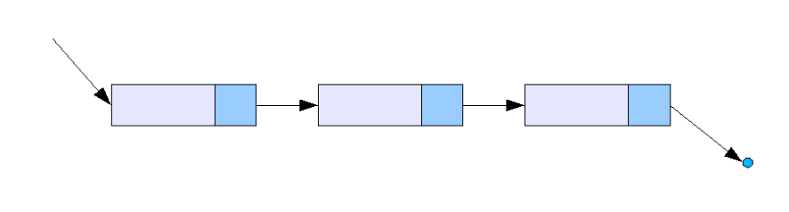
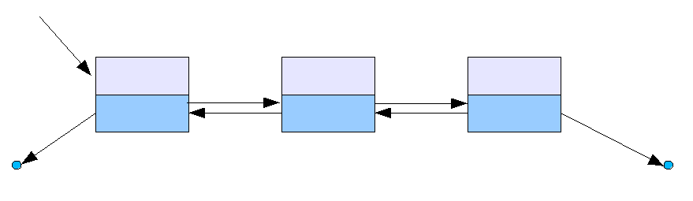
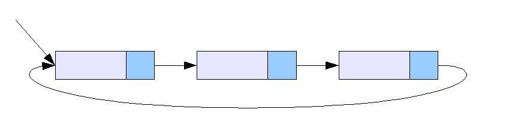
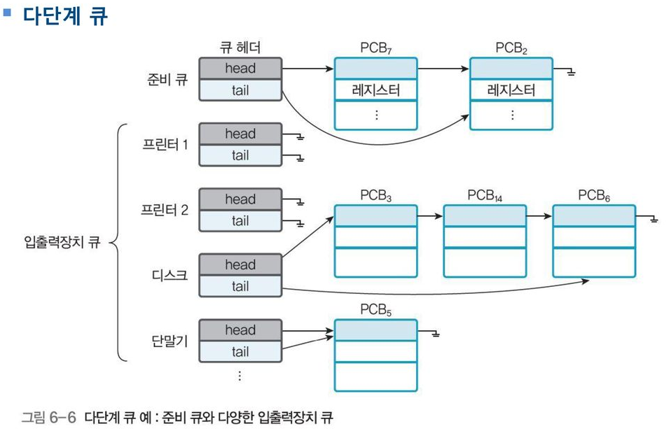

# 4주차 알고리즘 - 연결리스트

[toc]


## 연결리스트

1. 연결리스트

   - 각 노드가 데이터와 포인터를 가지고 한 줄로 연결되어 있는 방식으로 데이터를 저장하는 자료구조. 

   - 연결리스트의 종류

     - 단일 연결 리스트 : 각 노드에 자료 공간과 한 개의 포인터 공간이 있고, 각 노드의 포인터는 다음 노드를 가리킨다. 마지막 노드의 링크 값은 NULL . 

       - 한 쪽 방향으로만 노드를 따라가기 때문에 선행 노드를 찾기가 어렵다. 
       - 삭제하려면 앞 노드의 포인터를 알아야 하므로 임의의 노드 삭제가 어렵다.

       

     - 이중 연결 리스트 : 단일 연결 리스트와 비슷하지만, 포인터 공간이 두 개가 있고 각각의 포인터는 앞의 노드와 뒤의 노드를 가리킨다. 양방향 검색이 가능하다.

       - 

       

     - 원형 연결 리스트 : 일반적인 연결 리스트에 마지막 노드와 처음 노드를 연결시켜 원형으로 만든 구조이다.

       

   - 시간 복잡도

     - 삽입, 삭제 자체는 O(1)이다. 하지만 삽입, 삭제하기 위해 앞/뒤의 노드를 알아야하므로 O(n)이 걸릴 수도 있다. 

     |         방법          | 맨 앞 노드 | 맨 뒤 노드 | 임의의 노드 앞 | 임의의 노드 뒤 |
     | :-------------------: | :--------: | :--------: | :------------: | :------------: |
     |   단순 연결 리스트    |    O(1)    |  **O(n)**  |    **O(n)**    |      O(1)      |
     |   원형 연결 리스트    |    O(1)    |    O(1)    |    **O(n)**    |      O(1)      |
     |   이중 연결 리스트    |    O(1)    |  **O(n)**  |      O(1)      |      O(1)      |
     | 이중 원형 연결 리스트 |    O(1)    |    O(1)    |      O(1)      |      O(1)      |

   - 구현

     ```python
     # https://underflow101.tistory.com/3
     
     class Node(object):
         def __init__(self, data, next = None):
             self.data = data
             self.next = next
     
     class SList(object):
         def __init__(self):
             self.head = Node(None)
             self.size = 0
             
         def listSize(self):
             return self.size
         
         def is_empty(self):
             if self.size != 0:
                 return False
             else:
                 return True
             
         def selectNode(self, idx):
             if idx >= self.size:
                 print("Index Error")
                 return None
             if idx == 0:
                 return self.head
             else:
                 target = self.head
                 for cnt in range(idx):
                     target = target.next
                 return target
             
         def appendleft(self, value):
             if self.is_empty():
                 self.head = Node(value)
             else:
                 self.head = Node(value, self.head)
             self.size += 1
         
         def append(self, value):
             if self.is_empty():
                 self.head = Node(value)
                 self.size += 1
             else:
                 target = self.head
                 while target.next != None:
                     target = target.next
                 newtail = Node(value)
                 target.next = newtail
                 self.size += 1
             
         def insert(self, value, idx):
             if self.is_empty():
                 self.head = Node(value)
                 self.size += 1
             elif idx == 0:
                 self.head = Node(value, self.head)
                 self.size += 1
             else:
                 target = self.selectNode(idx-1)
                 if target == None:
                     return
                 newNode = Node(value)
                 tmp = target.next
                 target.next = newNode
                 newNode.next = tmp
                 self.size += 1
             
         def delete(self, idx):
             if self.is_empty():
                 print('Underflow: Empty Linked List Error')
                 return
             elif idx >= self.size:
                 print('Overflow: Index Error')
                 return
             elif idx == 0:
                 target = self.head
                 self.head = target.next
                 del(target)
                 self.size -= 1
             else:
                 target = self.selectNode(idx-1)
                 deltarget = target.next
                 target.next = target.next.next
                 del(deltarget)
                 self.size -= 1
                 
         def printlist(self):
             target = self.head
             while target:
                 if target.next != None:
                     print(target.data, '-> ', end='')
                     target = target.next
                 else:
                     print(target.data)
                     target = target.next
     ```

     

2. 연결리스트의 사용처

   - PCB (Process Control Block)

     - 운영체제가 프로세스를 제어하기 위해 정보를 저장해 놓는 곳으로, 프로세스의 상태 정보를 저장하는 구조체. 프로세스가 생성될 때마다 고유의 PCB가 생성되고, 프로세스가 완료되면 PCB는 제거된다.
     - Process ID, Process State, Program Counter, CPU Scheduling Information 등 정보를 저장한다.
     - 수행 중인 프로세스를 변경할 때, CPU의 레지스터 정보가 변경되는 것을 Context Switching 이라 함
     - PCB를 관리하기 위해 연결 리스트를 사용한다. Process가 생성되면 해당 Process의 PCB를 PCB link Head에 붙이고, 종료되면 해당 PCB를 linked List에서 삭제한다.

   - Context Switching

     - CPU가 이전의 프로세스 상태를 PCB에 보관하고, 또 다른 프로세스의 정보를 PCB에 읽어 레지스터에 적재하는 과정

   - CPU Scheduling

     - 다단계 큐에서도 linked list를 사용한다. 

     

   - Q. Ready나 Block도 Linked List로 관리한다고 했는데요! PCB에서 관리를 이미 하고 있는데 왜 굳이 따로 하는 것 일까요? [질문 출처](https://whereisusb.tistory.com/12)

     A. Process State는 3가지가 있는데 PCB List에는 이러한 상태들이 다 섞여있게 됩니다. 앞에서 잠깐 언급했던 CPU Scheduling은 Ready 상태인 Process를 가지고 하게 되는데요 PCB만 관리를 한다면 Ready만 다시 뽑아내야 하는 상태가 만들어 지게됩니다. Block과 Running도 마찬가지구요. 따라서 미리 Ready등을 Linked List로 관리하므로서 동작을 할 때 빠른시간에 할 수 있도록 하려는 목적이 있습니다.